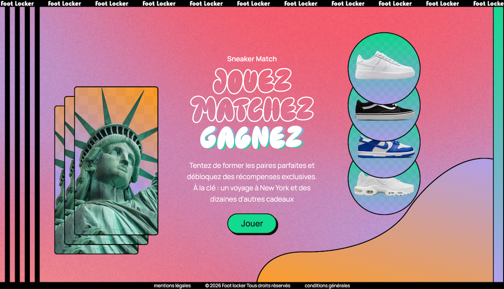
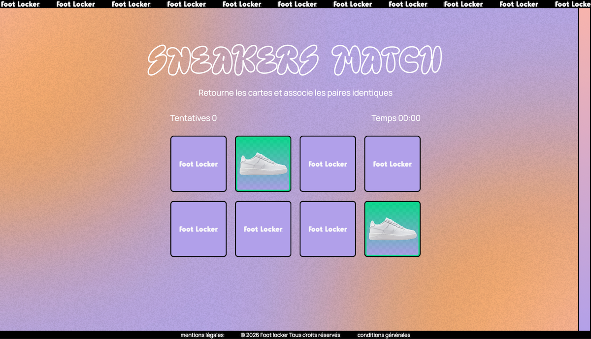
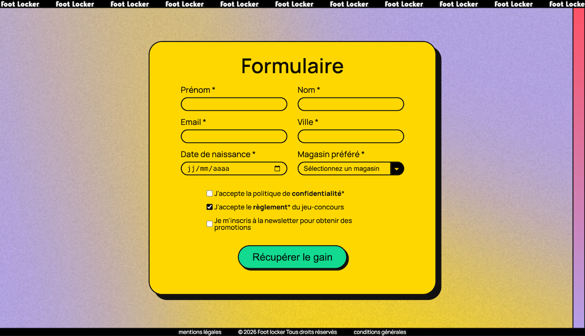

# Sneakers Match — Foot Locker (Projet HETIC)

Jeu marketing interactif conçu pour Foot Locker, pensé pour une utilisation **en magasin** (borne / tablette) et **en ligne**, afin de **collecter des données prospects** (email, téléphone, etc.) et d’alimenter de futures activations marketing.

> **Statut : V1 (Front + UI)**
>
> - ✅ Maquette UI (Figma)
> - ✅ Intégration front : 3 pages (HTML/CSS)
> - ⏳ Jeu / scoring / base de données / API : prévu (voir Roadmap)

<br>
👉 Démo : https://guillaume-zhu.github.io/sneakers-match-footlocker-front/

<br>

👉 Maquette Figma : https://www.figma.com/proto/0ejNFUFJFnJgVIQFfMNjkh/%C3%89quipe-3---%22Instant-gagnant%22-Template?node-id=2467-13571&t=bKnacukCwpjuNjQQ-1&scaling=min-zoom&content-scaling=fixed&page-id=2467%3A13570&starting-point-node-id=2467%3A13571&show-proto-sidebar=1

👉 Repo : https://github.com/guillaume-zhu/sneakers-match-footlocker-front

---

## 🎯 Problème & objectifs (brief)

En magasin, de nombreux visiteurs essaient des produits sans acheter immédiatement, puis finalisent leur achat en ligne.  
Ce projet vise à **mieux identifier ces prospects** via une expérience ludique de type borne jeux flash instant gagnant, afin de :

- améliorer la **connaissance client** (collecte de données),
- permettre des **activations marketing** futures (emailing, retargeting, offres personnalisées).

---

## 🧩 Rôle & contributions

Projet réalisé en binôme (cadre HETIC).  
**Mes contributions :**

- UI/UX : conception de l’identité et des écrans sur Figma (cohérence brand Foot Locker)
- Front-end : intégration des pages et mise en page responsive (mobile / borne)
- Collaboration : versioning Git/GitHub (travail en équipe)

---

## 🛠️ Stack (V1)

- **HTML5 / CSS3**
- **JavaScript** _(selon l’état actuel du repo)_
- **Figma**
- **Git / GitHub**

> Stack cible du brief (à venir) : React, Node.js / Express, SQLite ou JSON, déploiement Netlify, validation & bonnes pratiques sécurité.

---

## ✨ Parcours utilisateur (V1)

1. **Accueil** : présentation de l’expérience / call-to-action
2. **Jeu** : écran dédié à l’expérience interactive _(UI prête — logique à compléter si besoin)_
3. **Formulaire** : collecte d’informations (prospects) _(UI prête — validations à renforcer selon scope)_

---

## 📁 Structure

```
.
├── accueil.html
├── jeux.html
├── formulaire.html
├── docs/
│ ├── accueil.png
│ ├── jeu.png
│ ├── formulaire.png
├── components/
├── src/
│ ├── styles/
│ ├── images/
│ └── ...
└── README.md
```

---

## 🚀 Lancer le projet en local

### Option simple

Ouvrir `accueil.html` dans un navigateur.

### Option recommandée (Live Server)

1. Installer l’extension **Live Server** (VS Code)
2. Clic droit sur `accueil.html` → **Open with Live Server**
3. Naviguer Accueil → Jeu → Formulaire

---

## 🖼️ Aperçu

| Accueil                      | Jeu                  | Formulaire                         |
| ---------------------------- | -------------------- | ---------------------------------- |
|  |  |  |

---

## 🧭 Roadmap (prévue)

### V2 — Finalisation Front (intégration + responsive)

- Finaliser l’intégration **pixel-perfect** de la maquette (UI complète)
- Responsive **mobile / tablette / desktop** + adaptation “borne” (grands CTA, espacements, contrastes)
- Refactor CSS (structure, naming, variables/tokens si besoin)
- États UI (hover/focus/active)

### V3 — Gameplay & scoring

- Implémentation de la logique de jeu (états, paires, lock, reset, fin de partie)
- Score / temps / tentatives + écran de fin
- Stockage des résultats (BDD)

### V4 — Back-end & base de données

- API Node.js / Express
- Sauvegarder les scores et infos joueur (prototype)
  - option 1 : fichier JSON (mini base de données)
  - option 2 : vraie base de données (SQLite)
- Préparer l’étape “API” pour pouvoir enregistrer/récupérer ces données en ligne

### V5 — Déploiement & sécurité

- Déploiement Front (Netlify) + API
- Validation front + back, hygiène de code, gestion `.env`
- Durcissement sécurité (bonnes pratiques)

### V6 — Activations marketing

- Scénarios d’activation (emailing, segmentation, offres)
- Exports (CSV) / mini dashboard de suivi

---

## 🧾 Notes

- Projet réalisé dans un **cadre pédagogique (HETIC)**.
- Foot Locker est cité à des fins de démonstration / étude de cas.

---

## 🔗 Liens

- Maquette Figma : https://www.figma.com/proto/0ejNFUFJFnJgVIQFfMNjkh/%C3%89quipe-3---%22Instant-gagnant%22-Template?node-id=2467-13571&t=bKnacukCwpjuNjQQ-1&scaling=min-zoom&content-scaling=fixed&page-id=2467%3A13570&starting-point-node-id=2467%3A13571&show-proto-sidebar=1

- Démo : https://guillaume-zhu.github.io/sneakers-match-footlocker-front/
